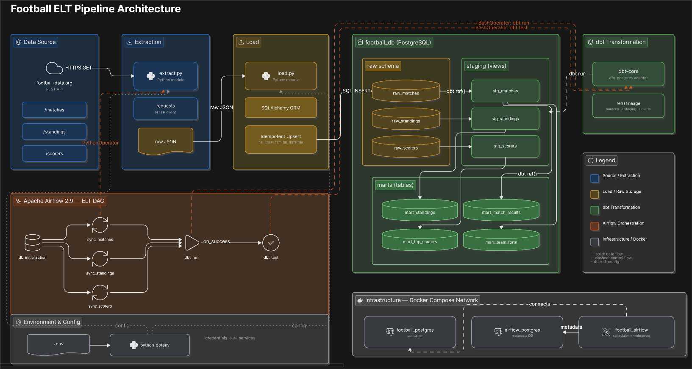

# Football ELT Pipeline

A daily, containerized **ELT pipeline** that ingests football competition data (matches, standings, and top scorers) from the [football-data.org](https://www.football-data.org/) API, lands it in **PostgreSQL**, and transforms it into analytics-ready models with **dbt**. **Apache Airflow** orchestrates the whole flow on a daily schedule, and a suite of **23 dbt tests** enforces data-quality guarantees on every run.

Built to practice the core building blocks of a modern data platform end to end: reliable ingestion, an idempotent load layer, layered SQL modeling, orchestration, and automated data-quality testing.

**Stack:** Python, SQLAlchemy, PostgreSQL, dbt, Apache Airflow, Docker Compose

---

## Architecture



The pipeline follows an **ELT** pattern — raw data is loaded first, then transformed inside the warehouse:

1. **Extract** (`elt/extract.py`) — Pulls matches, standings, and scorers for a configurable competition from the football-data.org v4 API.
2. **Load** (`elt/load.py`, `elt/models.py`) — Writes raw JSON into PostgreSQL tables (`raw_matches`, `raw_standings`, `raw_scorers`) via SQLAlchemy. Loads are **idempotent** so re-runs never create duplicates.
3. **Transform** (`dbt_football/`) — dbt builds a **staging layer** (typed, cleaned views) and a **marts layer** (analytics tables): a current league table with rate metrics, and a team-form model with last-five-match form.
4. **Orchestrate** (`dags/football_pipeline_dag.py`) — Airflow runs the DAG daily at 06:00, fanning out the three ingestion tasks in parallel before running and testing the dbt models.

```
db_init >> [sync_matches, sync_standings, sync_scorers] >> dbt_run >> dbt_test
```

---

## Data models

**Staging** (`materialized: view`) — one cleaned, type-cast view per source table: `stg_matches`, `stg_standings`, `stg_scorers`.

**Marts** (`materialized: table`):

- **`mart_standings`** — the current league table with derived metrics (points per game, win percentage, goals per game).
- **`mart_team_form`** — per-team season totals, home/away splits, and a rolling last-five-match form string (e.g. `W W D L W`).

Example (`mart_standings`, top of table):

| league_position | team                 | played | points |
|-----------------|----------------------|--------|--------|
| 1               | Arsenal FC           | 38     | 85     |
| 2               | Manchester City FC   | 38     | 78     |
| 3               | Manchester United FC | 38     | 71     |

---

## Design decisions and trade-offs

**ELT instead of ETL.** Raw API responses are loaded to Postgres untouched, and all business logic lives in version-controlled, testable dbt SQL. This keeps the raw layer replayable and makes transformations easy to review and evolve without re-fetching from the API.

**Idempotent loads, chosen per data type.** Matches are immutable events, so they are append-only and de-duplicated on their natural key (`match_id`). Standings and scorers are *mutable snapshots* that change every matchday, so they use `INSERT ... ON CONFLICT DO UPDATE` (upsert) keyed on `(competition, season, team)` / `(competition, season, player_name)`. Getting this grain right is what makes daily re-runs safe (see *A bug worth documenting* below).

**PostgreSQL as the warehouse.** For a dataset of a few hundred rows, a cloud warehouse like Snowflake or BigQuery would be overkill and add cost. Postgres is free, runs locally, and is more than enough here. The dbt models are written in standard SQL, so migrating to a columnar warehouse later would be mostly a profile change.

**Views for staging, tables for marts.** Staging models are views (no storage cost, always reflect the latest raw data); marts are materialized as tables for fast reads on the analytics layer. This trades a little compute at build time for cheaper, faster downstream queries.

**Isolated Airflow metadata database.** Airflow's metadata runs in its own Postgres instance, separate from the analytics database, so orchestration state and business data never interfere.

**`max_active_runs = 1`.** dbt swaps relations during a build, so overlapping DAG runs can collide on the same schema. Limiting the DAG to one active run at a time removes that class of failure.

**Cost.** The project runs entirely on local Docker and the football-data.org free tier, so it costs **nothing** to operate. The free API tier is rate-limited (10 requests/minute), which the daily, low-frequency schedule stays comfortably within. A production deployment would add real costs — managed Airflow (AWS MWAA, GCP Cloud Composer, or Astronomer) and a cloud warehouse — which is why those are deferred until there is a reason to deploy.

---

## Data quality

`dbt test` runs **23 tests** on every pipeline run, split into two kinds:

- **Generic tests** — uniqueness and not-null on keys, plus an `accepted_values` check on match status that validates the source API contract.
- **Singular tests** — football-domain invariants that catch bad data a schema check would miss, for example:
  - `points = 3 * wins + draws`
  - `played = wins + draws + losses`
  - `goal_difference = goals_for - goals_against`
  - a player's penalty goals can never exceed their total goals
  - only `FINISHED` matches are required to have scores
  - one standings row per team per season (grain enforcement)

---

## A bug worth documenting

Early on, the pipeline ran green every day but the **league table silently went stale** across seasons.

**Cause.** `raw_standings` was keyed on `team` alone. When a new season started, returning teams collided with their previous-season row and were skipped as duplicates, so the table stayed frozen at the prior season's final numbers. Only newly promoted teams were ever inserted.

**Fix.** The grain was corrected to `(competition, season, team)`, the load was rewritten as an idempotent upsert so each run refreshes the current season in place, and a dbt grain test was added to catch any regression. The result: the raw layer keeps full season history, and the marts scope cleanly to the current season.

This is a good reminder that "the DAG is green" is not the same as "the data is correct" — which is exactly why the data-quality tests exist.

---

## Running it locally

**Prerequisites:** Docker and Docker Compose, and a free API token from [football-data.org](https://www.football-data.org/client/register).

1. Create your environment file and fill in the values:

   ```bash
   cp .env.example .env
   ```

   ```
   API_KEY=your_football_data_org_token
   COMPETITION_CODE=PL          # e.g. PL = Premier League
   DB_HOST=postgres
   DB_PORT=5433
   DB_NAME=football_db
   DB_USER=postgres
   DB_PASSWORD=postgres
   AIRFLOW_UID=50000
   ```

2. Build and start the stack:

   ```bash
   docker compose up --build
   ```

3. Open the Airflow UI at **http://localhost:8080**, enable the `football_elt_pipeline` DAG, and trigger it (or wait for the 06:00 schedule).

To run the dbt models or tests on their own:

```bash
docker exec -it football_airflow bash -lc 'cd /opt/airflow/dbt_football && dbt build --profiles-dir .'
```

---

## Project structure

```
.
├── dags/
│   └── football_pipeline_dag.py   # Airflow DAG (daily orchestration)
├── elt/
│   ├── config.py                  # environment configuration
│   ├── extract.py                 # football-data.org API calls
│   ├── models.py                  # SQLAlchemy raw-table schema
│   └── load.py                    # idempotent loaders (append / upsert)
├── dbt_football/
│   ├── models/
│   │   ├── staging/               # cleaned, type-cast views
│   │   └── marts/                 # analytics tables
│   ├── tests/                     # singular data-quality tests
│   └── profiles.yml
├── docker-compose.yml             # PostgreSQL (x2) + Airflow
├── Dockerfile                     # Airflow image + Python deps
└── requirements.txt
```

---

## Roadmap

- **CI on GitHub Actions** — lint (ruff, sqlfluff) and run the dbt tests against seeded fixtures on every pull request.
- **Incremental models** — switch marts to incremental materialization as history grows.
- **Multi-competition support** — parameterize the DAG to run several leagues.
- **Cloud deployment** — run on a managed Airflow service against a cloud warehouse.

---

*Architecture diagram made with [Eraser](https://www.eraser.io/).*